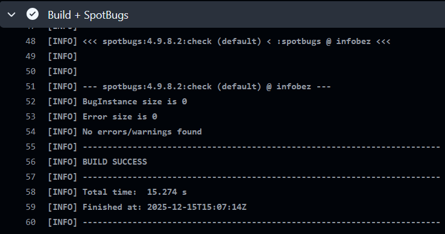
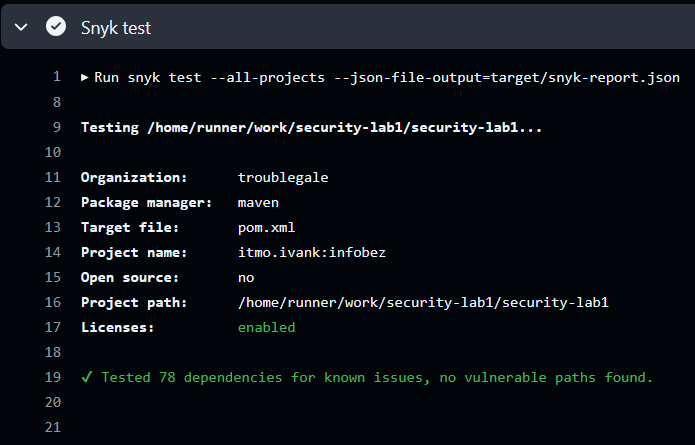

# Защищенный REST API синтеграцией в CI/CD

Учебный проект: простое, но защищённое Web API на **Java 17 + Spring Boot 3 + Spring Security**, с хранением данных в **PostgreSQL**, аутентификацией через **JWT**, хэшированием паролей (**BCrypt**), и CI-проверками безопасности:
- **SAST**: SpotBugs
- **SCA**: Snyk

## Стек

- Java 17
- Spring Boot (Web, Security, Data JPA, Validation)
- PostgreSQL
- Hibernate (JPA)
- JWT (jjwt)
- OWASP Java Encoder (экранирование данных)
- CI: GitHub Actions + SpotBugs + Snyk

## Запуск проекта

`docker compose up -d --build`

## API

### 1. Регистрация (`POST /auth/register`)

Тело запроса:
```
{
  "username": "<script>alert('1')</script>",
  "password": "<script>alert('1')</script>"
}
```

Пример ответа:
```
{
  "id": 2,
  "username": "&lt;script&gt;alert('1')&lt;/script&gt;"
}
```

### 2. Логин (`POST /auth/login`)

Тело запроса:
```
{
  "username": "infobez",
  "password": "infobez111"
}
```

Пример ответа:
```
{
  "tokenType": "Bearer",
  "token": "eyJhbGciOiJIUzI1NiIsInR5cCI6IkpXVCJ9..."
}
```

### 3. Защищённый эндпоинт с данными (`GET /api/data`)

Пример ответа:
```
[
    {
        "id": 1,
        "username": "infobez",
        "role": "USER"
    },
    {
        "id": 2,
        "username": "&lt;script&gt;alert('1')&lt;/script&gt;",
        "role": "USER"
    }
]
```

## Реализованные меры защиты

### 1. Защита от SQL-инъекций

**Подход:** используется **ORM** (Hibernate через Spring Data JPA).
SQL запросы не собираются конкатенацией строк.

Пример репозитория:
```
public interface UserRepository extends JpaRepository<User, Long> {
    Optional<User> findByUsername(String username);
    boolean existsByUsername(String username);
}
```

### 2. Защита от XSS

**Проблема:** если вернуть в API "сырые" пользовательские строки, клиент может отрендерить их как HTML/JS.

**Решение:** все пользовательские данные, которые возвращаются в ответах API, экранируются библиотекой OWASP Java Encoder.

Пример в контроллере:
```
return Map.of(
    "id", (Object) u.getId(),
    "username", Encode.forHtmlContent(u.getUsername()),
    "role", Encode.forHtmlContent(u.getRole())
);
```

### 3. Защита от Broken Authentication

#### 3.1. Работа с паролями

Пароли **НЕ хранятся в открытом виде**, используется BCrypt (Spring Security PasswordEncoder):

Фрагмент конфигурации:
```
@Bean
public PasswordEncoder passwordEncoder() {
    return new BCryptPasswordEncoder();
}
```

Хэширование при регистрации:
```
u.setPasswordHash(encoder.encode(req.password()));
```

#### 3.2. JWT

После успешной аутентификации выдаётся JWT:
```
public String generate(String subject) {
    Instant now = Instant.now();
    Instant exp = now.plusSeconds(ttlMinutes * 60);
    return Jwts.builder()
        .subject(subject)
        .issuedAt(Date.from(now))
        .expiration(Date.from(exp))
        .signWith(key)
        .compact();
}
```

Middleware проверяет JWT на всех защищённых эндпоинтах.

Реализован собственный `OncePerRequestFilter`, его фрагмент:
```
String header = request.getHeader("Authorization");
if (header != null && header.startsWith("Bearer ")) {
    String token = header.substring(7);
    String username = jwtService.validateAndGetSubject(token);

    var userDetails = userDetailsService.loadUserByUsername(username);
    var auth = new UsernamePasswordAuthenticationToken(
        userDetails, null, userDetails.getAuthorities()
    );
    SecurityContextHolder.getContext().setAuthentication(auth);
}
```

#### 3.3. Конфигурация эндпоинтов
Разрешаем публично только:
- `/auth/register`
- `/auth/login`

А всё остальное — только с JWT:
```
http
  .sessionManagement(sm -> sm.sessionCreationPolicy(SessionCreationPolicy.STATELESS))
  .authorizeHttpRequests(auth -> auth
      .requestMatchers("/auth/login", "/auth/register").permitAll()
      .anyRequest().authenticated()
  )
  .addFilterBefore(jwtAuthFilter, UsernamePasswordAuthenticationFilter.class);
```

## CI/CD: SAST + SCA

При каждом push и pull_request запускается workflow GitHub Actions:
- mvn verify (включая SpotBugs)
- snyk test (проверка зависимостей)

Отчёты SpotBugs и Snyk можно загрузить как артефакты выполнения пайплайнов.

Пример успешного пайплайна: [https://github.com/troublegale/security-lab1/actions/runs/20236999115](https://github.com/troublegale/security-lab1/actions/runs/20236999115)

Скриншоты отчётов:




